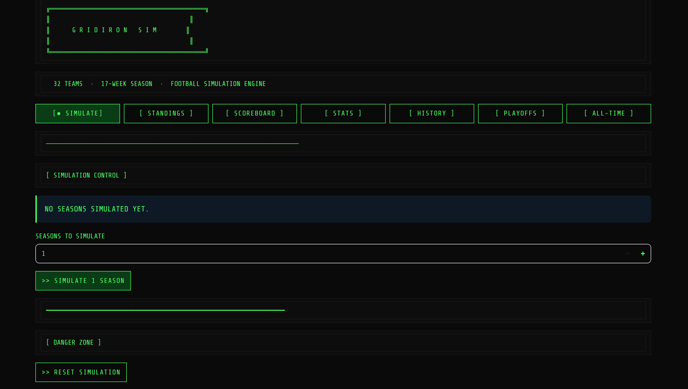

# Gridiron Sim

A fictional-football season simulator — a Streamlit web app over SQLite that
simulates entire seasons (regular season → playoffs → Super Bowl), tracks every
standard football stat, and presents it all in a terminal/ASCII style. No real
teams or players: 32 fictional teams across two conferences and four divisions each.



## Features

- **Simulate** any number of seasons at once.
- **Standings** by conference/division, full **Scoreboard** with team search.
- **Game detail view** with an ASCII player-figure animation + commentary + rare events.
- **Stats leaders** for every position group (passing, rushing, receiving, defense,
  kicking, punting).
- **Playoffs** — a 14-team bracket through to a Super Bowl, with champions tracked.
- **All-Time** records: team records, best/worst seasons & games, leaders and worst
  performers by position, and postseason all-time views.
- **Player careers** — aging, retirement, and a per-player career cap (max 25 seasons).

## How the simulation works (where the data comes from)

**All data is generated procedurally — there is no external data source, no real
stats, and no internet calls.** Everything you see is produced from a rating-based
statistical model using random draws (numpy normal / Poisson distributions). On a
fresh database the app builds the whole league from scratch, then each simulated
game manufactures its own box score.

**1. The league is generated.** Each of the 32 teams gets an offensive and defensive
rating drawn from a normal distribution (mean 50, clamped to ~20–85). Every team is
then given a full roster: starters are rated around the team's overall, backups a bit
lower, each with an age and a randomized career length.

**2. Each game is simulated from ratings.** A game's expected score comes from the
matchup — roughly `21 + (offense − opposing defense) × 0.25`, plus a home-field bump.
The actual final score is a random draw around that expectation, so a strong team
usually beats a weak one but upsets still happen.

**3. The box score is built to match the score.** Once a final score exists, the
engine works backward to produce realistic, internally consistent team stats
(total yards, pass/rush split, touchdowns, turnovers, penalties, time of possession,
etc.), then **distributes those team totals to individual players by position** — the
QB gets the passing yards, running backs split the carries, receivers split targets,
defenders get tackles/sacks/interceptions, and so on.

**4. Seasons, playoffs, and careers persist.** Every game's team and player stats are
written to SQLite, so standings, leaders, and all-time records are just queries over
accumulated games. Between seasons, players age and retire (career-capped), and
replacements are generated — so the league evolves over time.

In short: ratings → expected score → random final score → a consistent box score →
stored in the database. Tweak the knobs in `config.py` and the distributions in
`engine/` and the whole statistical world changes.

## Run it

```sh
# Windows
"Start Sports Sim.bat"          # creates a venv, installs deps, launches the app

# or manually (any OS)
python -m venv .venv
.venv/Scripts/pip install -r requirements.txt   # (Scripts\ on Windows; bin/ elsewhere)
.venv/Scripts/streamlit run app.py
```

The SQLite database (`data/league.db`) is created automatically on first run.

## Layout

| Path | Role |
|---|---|
| `app.py` | Streamlit UI — views, game detail, ASCII animation |
| `config.py` | Tunables (number of teams, weeks per season, start year) |
| `data/database.py` | SQLite schema, migrations, connection helpers |
| `engine/` | Simulation: team/player generation, game sim, seasons, playoffs |

## Tech

Python · Streamlit · SQLite · pandas · numpy
